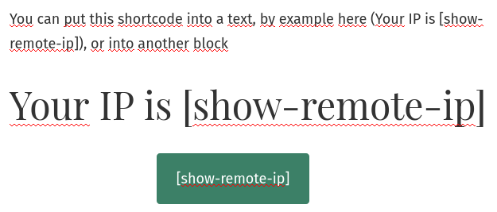
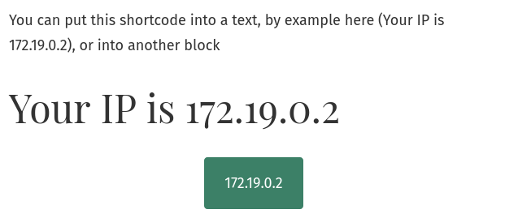

# Show remote IP
Just show the remote IP of client (with a shortcode [show-remote-ip])

## To install
Admin -> Plugin -> Ad new and find "Show remote IP"

https://wordpress.org/plugins/promotore-simple-analytics/

## Screenshot

### Ajustes

### Fuente

### Testing Action

1. Create `.secrets` file
  SVN_USERNAME=[user-name]
  SVN_PASSWORD=[pass]

2. Run `act --secret-file .secrets`
